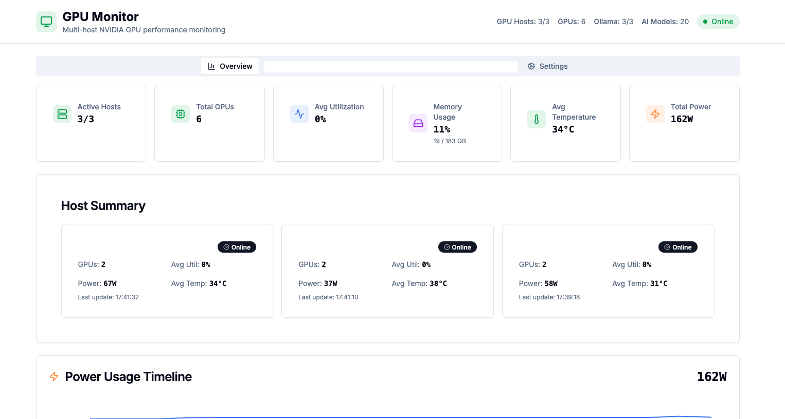
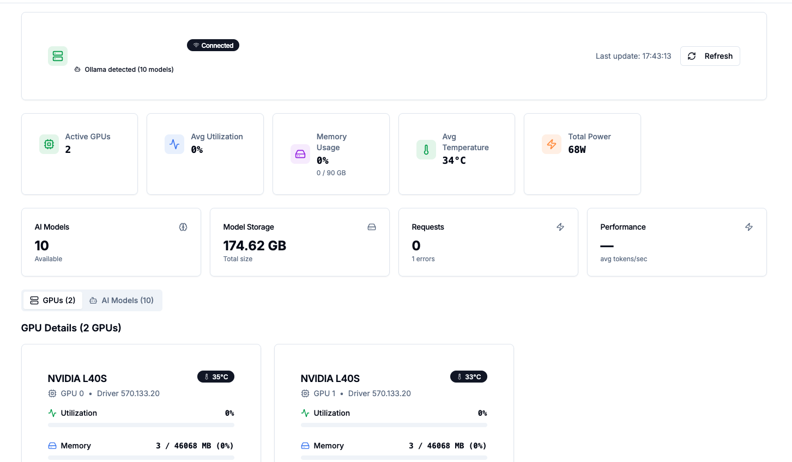

# 🖥️ GPU Monitor Dashboard

**A modern, real-time GPU monitoring dashboard with AI/ML integration**

Monitor NVIDIA GPUs and Ollama AI models across multiple hosts from a single, comprehensive dashboard. Built with React, TypeScript, and Flask for production-ready deployments.

    


*Multi-host GPU monitoring dashboard with real-time metrics and Ollama AI model integration*

## 📸 Screenshots

### Dashboard Views

| View | Description |
|------|-------------|
|  | **Overview Tab**: Multi-host summary with aggregated GPU and Ollama metrics |
|  | **Host Tab**: Detailed GPU monitoring with process tracking |
|  | **AI Models Tab**: Ollama model inventory and performance |
|  | **Settings Tab**: Host management and configuration |

## ✨ Key Features

| Feature | Description |
|---------|-------------|
| 🖥️ **Multi-Host GPU Monitoring** | Monitor GPUs across multiple servers from one dashboard |
| 🤖 **AI/ML Integration** | Auto-discover and monitor Ollama AI model servers |
| 📊 **Real-Time Metrics** | Live GPU utilization, temperature, memory, and power monitoring |
| 🔄 **Auto-Refresh** | Configurable refresh intervals (2s - 30s) |
| 🐳 **Docker Ready** | Complete containerized deployment with Docker Compose |
| 🔒 **Production Security** | Environment-based configuration with no hardcoded secrets |
| 📱 **Responsive Design** | Works seamlessly on desktop, tablet, and mobile |
| ⚡ **Performance Optimized** | Built with modern React, TypeScript, and Vite |

## 🚀 Features

### Multi-Host Monitoring
- **Multiple GPU Hosts**: Monitor GPUs across different servers from a single dashboard
- **Real-time Updates**: Configurable refresh intervals (2s, 5s, 10s, 30s, or manual)
- **Connection Status**: Live connection monitoring with visual indicators
- **Tabbed Interface**: Clean navigation between overview and individual hosts

### GPU Metrics
- **Performance Monitoring**: GPU utilization, temperature, memory usage, power consumption
- **Process Tracking**: Live monitoring of GPU processes with memory usage
- **Energy Cost Calculation**: Track energy costs with configurable rates ($/kWh)
- **Historical Overview**: Aggregated statistics across all connected hosts

### AI/ML Integration
- **Ollama Auto-Discovery**: Automatic detection and monitoring of Ollama AI model servers
- **Model Management**: Track deployed models, storage usage, and performance metrics
- **Performance Analytics**: Monitor tokens/second, request counts, and response times
- **Resource Correlation**: View GPU usage alongside AI model performance

### Modern UI/UX
- **Responsive Design**: Works on desktop, tablet, and mobile devices
- **Dark/Light Mode**: Automatic theme detection
- **Real-time Animations**: Smooth progress bars and loading states
- **Toast Notifications**: User-friendly feedback for all actions

### Security & Configuration
- **Environment-based Configuration**: No hardcoded secrets or IPs
- **Sanitized Codebase**: All sensitive information moved to environment variables
- **Docker Support**: Easy deployment with Docker containers
- **CORS Protection**: Configurable cross-origin resource sharing

## 📋 Prerequisites

### System Requirements
- **NVIDIA GPU** with drivers installed
- **nvidia-smi** command available
- **Python 3.8+** for the backend
- **Node.js 18+** for the frontend

### Required Dependencies
- Docker (optional, for containerized deployment)
- Modern web browser (Chrome, Firefox, Safari, Edge)
- Ollama (optional, for AI model monitoring)

## 🛠 Installation

### Method 1: Docker Deployment (Recommended)

1. **Clone the repository**
   ```bash
   git clone <repository-url>
   cd gpu-dash-glow
   ```

2. **Configure environment variables**
   ```bash
   cp .env.example .env
   # Edit .env with your configuration
   ```

3. **Deploy with Docker Compose**
   ```bash
   docker-compose up -d
   ```

4. **Access the dashboard**
   - Frontend: http://localhost:8080
   - Backend API: http://localhost:5000

### Method 2: Manual Installation

#### Backend Setup
1. **Navigate to server directory**
   ```bash
   cd server
   ```

2. **Install Python dependencies**
   ```bash
   pip install -r requirements.txt
   ```

3. **Configure environment**
   ```bash
   cp ../.env.example .env
   # Edit .env file with your settings
   ```

4. **Start the Flask server**
   ```bash
   python app.py
   ```

#### Frontend Setup
1. **Navigate to project root**
   ```bash
   cd ..
   ```

2. **Install Node.js dependencies**
   ```bash
   npm install
   ```

3. **Configure environment**
   ```bash
   # Create .env for frontend if needed
   echo "VITE_API_URL=http://localhost:5000" > .env
   ```

4. **Start the development server**
   ```bash
   npm run dev
   ```

## ⚙️ Configuration

### Environment Variables

Create a `.env` file based on `.env.example`:

```bash
# Backend Server Configuration
FLASK_HOST=0.0.0.0
FLASK_PORT=5000
FLASK_DEBUG=false

# Frontend Configuration  
VITE_PORT=8080
VITE_API_URL=http://localhost:5000
VITE_DEFAULT_HOST_URL=http://your-gpu-server:5000/nvidia-smi.json

# Security Configuration
FLASK_SECRET_KEY=your-secret-key-here-change-this

# Optional: CORS Configuration
CORS_ORIGINS=http://localhost:8080,http://localhost:3000
```

### Application Settings

Configure the following through the Settings tab in the web interface:

#### Global Settings
- **Demo Mode**: Enable/disable demo mode with sample data
- **Refresh Interval**: Set automatic refresh rate (2s - 30s)
- **Energy Rate**: Configure electricity cost per kWh for cost calculations

#### Host Management
- **Add GPU Hosts**: Configure multiple GPU monitoring endpoints
- **Connection Monitoring**: Real-time status of each configured host
- **Host Naming**: Custom display names for better organization

## 🚦 Usage

### Adding GPU Hosts

1. **Access Settings Tab**
   - Navigate to the Settings tab in the dashboard
   
2. **Add New Host**
   - Enter the full URL to your GPU server's nvidia-smi endpoint
   - Example: `http://192.168.1.100:5000/nvidia-smi.json`
   - Optionally provide a custom display name
   
3. **Verify Connection**
   - The dashboard will automatically test the connection
   - Connection status is displayed with visual indicators

### Monitoring Features

#### Overview Tab
- **Aggregated Statistics**: Combined metrics from all connected hosts
- **Global Metrics**: Total GPUs, average utilization, temperature, power consumption
- **Host Summary**: Quick status overview of each configured host
- **Energy Cost Tracking**: Real-time cost calculations across all hosts

#### Individual Host Tabs
- **Detailed GPU Information**: Per-GPU metrics and performance data
- **Process Monitoring**: Active GPU processes with memory usage
- **Real-time Charts**: Live performance visualization
- **Host-specific Settings**: Connection status and refresh controls

### API Endpoints

The backend provides the following REST API endpoints:

```bash
# GPU Data
GET /nvidia-smi.json          # Current GPU status and metrics

# Host Management  
GET /api/hosts                # List all configured hosts
POST /api/hosts               # Add a new host
DELETE /api/hosts/<url>       # Remove a host

# Ollama Integration
POST /api/ollama/discover     # Discover Ollama on a host

# Health Check
GET /api/health               # Server health status
```

## 🤖 Ollama Integration

The dashboard includes built-in support for monitoring Ollama AI model servers alongside GPU metrics.


*Ollama AI models view showing installed models and performance metrics*

### Features

- **Auto-Discovery**: Automatically detects Ollama instances running on GPU hosts
- **Model Inventory**: Lists all installed models with size and metadata
- **Performance Metrics**: Real-time tokens/second, request counts, and latency
- **Resource Correlation**: Shows GPU usage alongside AI model performance
- **Multi-Host Support**: Monitor Ollama across multiple servers

### How It Works

1. **Automatic Scanning**: The dashboard scans common ports (11434, 8080, 3000, 5000) for Ollama services
2. **Direct API Communication**: Connects directly to Ollama endpoints on GPU hosts
3. **Real-time Metrics**: Fetches performance data from Ollama's `/api/ps` and `/api/tags` endpoints
4. **Integrated Display**: Shows Ollama metrics directly in host tabs alongside GPU data


*Real-time Ollama performance metrics integrated with GPU monitoring*

### Supported Metrics

- **Model Statistics**: Count, total storage size, average model size
- **Performance**: Tokens per second, response latency, request counts
- **Status**: Active models, VRAM usage, error rates
- **Storage**: Model sizes, total storage consumption

### Configuration

No additional configuration is required. The dashboard will automatically discover and monitor Ollama instances on any configured GPU host.

### Example Models Display

When Ollama is detected on a host, you'll see:
- **Overview Cards**: AI Models count, Model Storage usage, Request metrics, Performance stats
- **Models Tab**: Detailed list of all installed models with sizes
- **Visual Indicators**: Bot icon showing Ollama detection status

## 🚀 Quick Start

Get up and running in less than 2 minutes:

```bash
# 1. Clone the repository
git clone <your-repository-url>
cd gpu-dash-glow

# 2. Start with Docker (recommended)
docker-compose up -d

# 3. Access the dashboard
# Frontend: http://localhost:8080
# API: http://localhost:5000
```

That's it! The dashboard will auto-discover any Ollama instances and start monitoring your GPUs.

## 📊 Supported GPU Metrics

### Performance Metrics
- **GPU Utilization**: Percentage of GPU compute usage
- **Memory Usage**: VRAM usage and availability
- **Temperature**: GPU core temperature in Celsius
- **Power Consumption**: Current power draw and limits
- **Fan Speed**: Cooling fan RPM and percentage

### Process Information
- **Active Processes**: All GPU-accelerated processes
- **Memory Allocation**: Per-process GPU memory usage
- **Process Names**: Application names using GPU resources
- **Process IDs**: System process identifiers

### System Information
- **Driver Version**: NVIDIA driver version
- **GPU Model**: Graphics card model and specifications
- **UUID**: Unique GPU identifiers
- **Clock Speeds**: GPU and memory clock frequencies

## 🔧 Development

### Project Structure
```
gpu-dash-glow/
├── src/                    # Frontend React application
│   ├── components/         # React components
│   ├── hooks/             # Custom React hooks
│   ├── pages/             # Application pages
│   └── types/             # TypeScript definitions
├── server/                # Backend Flask application
│   ├── app.py             # Main Flask application
│   ├── requirements.txt   # Python dependencies
│   └── Dockerfile         # Backend container config
├── public/                # Static assets
├── docs/                  # Documentation
└── docker-compose.yml     # Multi-container deployment
```

### Technology Stack

#### Frontend
- **React 18**: Modern React with hooks and concurrent features
- **TypeScript**: Type-safe development
- **Tailwind CSS**: Utility-first CSS framework
- **Vite**: Fast build tool and development server
- **React Query**: Server state management
- **Shadcn/ui**: Modern UI component library

#### Backend
- **Flask**: Lightweight Python web framework
- **Flask-CORS**: Cross-origin resource sharing
- **nvidia-ml-py3**: NVIDIA GPU monitoring library
- **python-dotenv**: Environment variable management

#### Infrastructure
- **Docker**: Containerization
- **Docker Compose**: Multi-service orchestration
- **nginx**: Reverse proxy (production)

### Building for Production

1. **Build frontend**
   ```bash
   npm run build
   ```

2. **Build Docker images**
   ```bash
   docker-compose build
   ```

3. **Deploy to production**
   ```bash
   docker-compose -f docker-compose.prod.yml up -d
   ```

## 🛡️ Security

### Security Measures Implemented

1. **No Hardcoded Secrets**: All sensitive information uses environment variables
2. **Input Validation**: Proper validation of all user inputs
3. **CORS Protection**: Configurable cross-origin request handling
4. **Environment Isolation**: Separate configuration for different environments
5. **Secure Defaults**: Safe default values for all configuration options

### Security Best Practices

- **Environment Variables**: Never commit `.env` files to version control
- **Network Security**: Use HTTPS in production deployments
- **Access Control**: Implement authentication for production use
- **Regular Updates**: Keep dependencies updated for security patches
- **Monitoring**: Enable logging for security audit trails

## 🐛 Troubleshooting

### Common Issues

#### Backend Issues
1. **"nvidia-smi not found"**
   - Ensure NVIDIA drivers are installed
   - Verify nvidia-smi is in system PATH
   - Check GPU accessibility permissions

2. **"Permission denied" errors**
   - Run with appropriate user permissions
   - Check file system permissions for logs/data directories

3. **"Port already in use"**
   - Change FLASK_PORT in environment variables
   - Kill existing processes using the port

#### Frontend Issues
1. **"Failed to connect to server"**
   - Verify backend is running on correct port
   - Check VITE_API_URL configuration
   - Ensure CORS is properly configured

2. **"Host unreachable" errors**
   - Verify host URLs are correct and accessible
   - Check network connectivity between hosts
   - Ensure target hosts have nvidia-smi endpoint available

#### Docker Issues
1. **"GPU not accessible in container"**
   - Install nvidia-docker2
   - Use appropriate runtime configuration
   - Verify GPU passthrough settings

### Debug Mode

Enable debug mode for detailed logging:

```bash
# Backend debugging
FLASK_DEBUG=true python server/app.py

# Frontend debugging
npm run dev -- --debug
```

### Performance Optimization

1. **Reduce Refresh Intervals**: Lower frequency for better performance
2. **Limit Host Count**: Monitor fewer hosts for resource efficiency
3. **Network Optimization**: Use local network connections when possible
4. **Browser Performance**: Close unused tabs, use modern browsers

## 📚 API Documentation

### REST API Reference

#### GPU Data Endpoint
```http
GET /nvidia-smi.json
Content-Type: application/json

Response:
{
  "host": "server-hostname",
  "timestamp": "2024-01-01T12:00:00Z",
  "gpus": [
    {
      "id": 0,
      "uuid": "GPU-12345678-1234-1234-1234-123456789abc",
      "name": "NVIDIA RTX 4090",
      "driver_version": "535.98",
      "temperature": 65,
      "utilization": 85,
      "memory": {
        "used": 12000,
        "total": 24000
      },
      "power": {
        "draw": 350,
        "limit": 450
      },
      "fan": 75,
      "processes": [
        {
          "pid": 1234,
          "name": "python",
          "memory": 8000
        }
      ]
    }
  ]
}
```

#### Host Management Endpoints
```http
# List all hosts
GET /api/hosts

# Add new host
POST /api/hosts
Content-Type: application/json
{
  "url": "http://server:5000/nvidia-smi.json",
  "name": "Production Server"
}

# Remove host
DELETE /api/hosts/http%3A//server%3A5000/nvidia-smi.json
```

## 🤝 Contributing

### Development Workflow

1. **Fork the repository**
2. **Create a feature branch**
   ```bash
   git checkout -b feature/your-feature-name
   ```
3. **Make your changes**
4. **Test thoroughly**
   ```bash
   npm test
   npm run build
   ```
5. **Commit with clear messages**
   ```bash
   git commit -m "feat: add new monitoring feature"
   ```
6. **Push and create pull request**

### Code Style

- **Frontend**: ESLint + Prettier configuration
- **Backend**: PEP 8 Python style guide
- **Commits**: Conventional commit format
- **Documentation**: Clear comments and README updates

### Testing

```bash
# Frontend tests
npm test

# Backend tests
cd server && python -m pytest

# Integration tests
npm run test:e2e
```

## 📄 License

This project is licensed under the MIT License - see the [LICENSE](LICENSE) file for details.

## 📝 Changelog

### Latest Updates (v2.1.0)
- ✅ **Ollama Integration**: Auto-discovery and monitoring of AI models
- ✅ **Direct API Communication**: Frontend connects directly to GPU host backends
- ✅ **Flask Route Fixes**: Corrected route decorator syntax for all endpoints
- ✅ **Enhanced UI**: Added AI model tabs and performance metrics display
- ✅ **Security Improvements**: Removed sensitive information from version control

### Previous Releases
- v2.0.0: Multi-host monitoring support
- v1.5.0: Docker containerization
- v1.0.0: Initial release with single-host GPU monitoring

## 🙏 Acknowledgments

- **NVIDIA** for GPU monitoring tools and drivers
- **Ollama** for local AI model serving
- **React** community for excellent libraries and tools
- **Flask** community for lightweight web framework
- **Tailwind CSS** for modern styling utilities
- **Shadcn/ui** for beautiful UI components

## 📞 Support

### Getting Help

1. **Documentation**: Check this README and inline code comments
2. **Issues**: Open a GitHub issue for bugs or feature requests
3. **Discussions**: Use GitHub Discussions for questions and ideas

### Reporting Security Issues

For security-related issues, please email directly rather than opening public issues.

---

**Built with ❤️ for the GPU monitoring community**