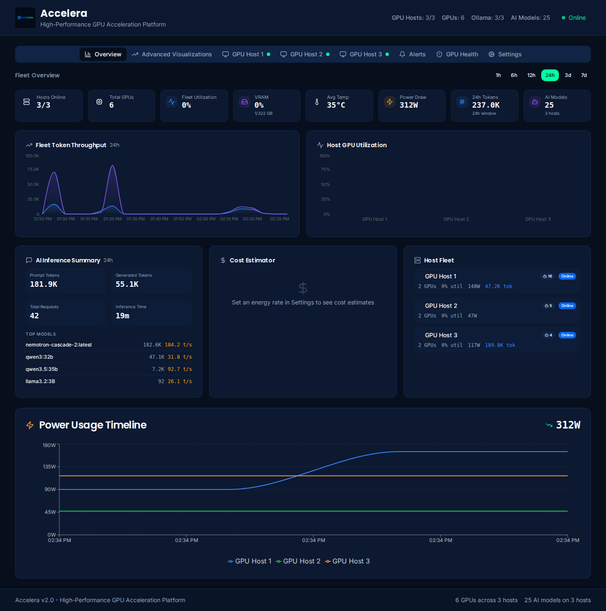
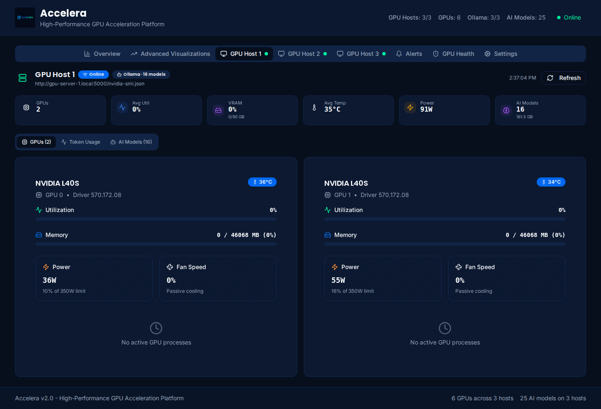
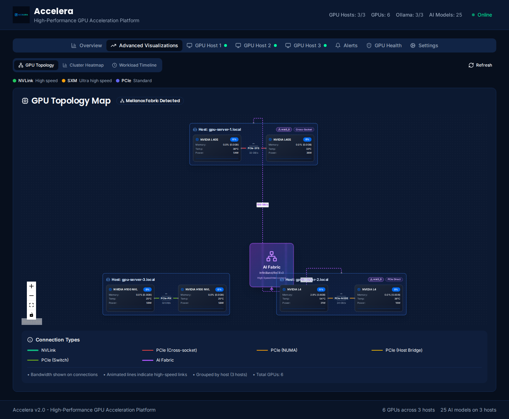
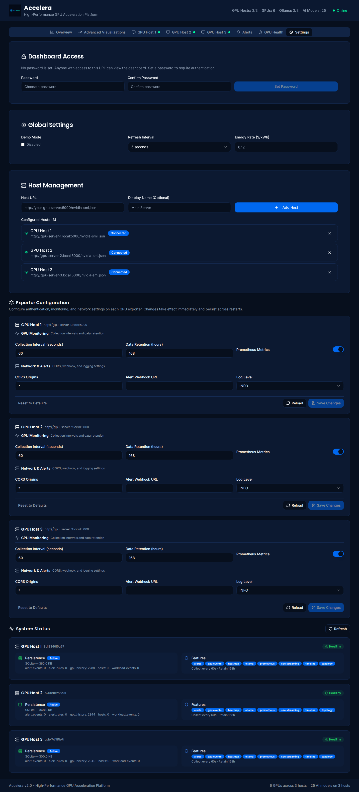

# Accelera — GPU Acceleration Platform

Real-time monitoring, AI workload management, and cluster analytics for NVIDIA GPU infrastructure.


<p align="center">
  
</p>

---

## Features

### Fleet Overview Dashboard
- **GPU metrics** — utilization, VRAM, temperature, power draw, fan speed
- **Multi-host** — monitor unlimited servers from a single pane
- **Fleet-wide token stats** — aggregate prompt/generated tokens, tokens/sec, cost estimation across all hosts
- **Time-range picker** — toggle 1 h / 6 h / 12 h / 24 h / 3 d / 7 d windows on overview and per-host stats
- **Per-host detail tabs** — deep-dive into individual server metrics, Ollama models, and token history

### AI Workload Integration
- **Ollama auto-discovery** — detects running Ollama instances on each GPU host
- **SGLang auto-discovery** — detects SGLang Runtime servers (OpenAI-compatible `/v1/models`)
- **Token statistics** — collected from Ollama Prometheus metrics, stored in SQLite, served via `/api/tokens/stats`
- **Per-model breakdown** — generated tokens, prompt tokens, requests, avg tokens/sec per model
- **Time-series charts** — 5-minute bucket token history with Recharts area/bar charts

### Advanced Visualizations
- **GPU topology map** — interactive ReactFlow diagram showing NVLink / SXM / PCIe interconnections
- **3D cluster heatmap** — Plotly.js surface plot for utilization, temperature, power, or memory over time
- **AI workload timeline** — vis-timeline Gantt chart of model loading, inference, training, and GPU allocation events
- **Compact legends & time picker** — inline colored-dot legends, per-tab refresh, heatmap time range selector

### GPU Process Inspector
- **Deep process analysis** — PID, resolved name, command line, user, VRAM, uptime, CPU%
- **AI runtime detection** — automatically identifies Ollama, SGLang, vLLM, Triton, PyTorch processes
- **Model name resolution** — queries Ollama `/api/ps`, SGLang `/v1/models`, and vLLM `/v1/models` to match running models
- **Auto-refresh** — 10-second polling for near-real-time process monitoring
- **Enriched GPU cards** — process list on GPU cards shows resolved names, runtime badges, and model info

### AI Model Benchmark Runner
- **One-click benchmarks** — test Ollama, SGLang, and vLLM model throughput with preset prompts
- **Key metrics** — tokens/sec, time-to-first-token, generated tokens, total duration
- **Benchmark history** — results persisted in SQLite, viewable in a collapsible table

### Alerting & Events
- **Custom alert rules** — threshold-based alerts on any GPU metric (utilization, temp, power, memory)
- **GPU health events** — NVML error detection and dmesg Xid parsing
- **Webhook notifications** — Slack (Block Kit), Discord (embeds), and generic HTTP webhook delivery with auto-detection
- **Email notifications** — SMTP-based alert delivery

### Security
- **URL validation** — all host/Ollama URLs validated before use (SSRF protection)
- **Auto-generated secret key** — Flask secret key auto-generated if not set
- **Parameterized SQL** — no string interpolation in queries
- **Secret masking** — sensitive config values masked in API responses
- See [SECURITY.md](SECURITY.md) for the full audit

---

## Screenshots

### Fleet Overview

*3-host GPU cluster with fleet token throughput, AI inference summary, power timeline, and host status.*

### Per-Host Detail

*Individual GPU cards with utilization, VRAM, temperature, power, fan speed, and running processes.*

### GPU Topology Map

*Interactive topology showing NVLink, PCIe, and Mellanox fabric interconnections across all hosts.*

### Settings & Host Management

*Dashboard access, refresh interval, energy rate, and host URL management.*

---

## Architecture

```
┌──────────────────┐     ┌──────────────────┐     ┌──────────────────┐
│   React Frontend │     │  GPU Exporter    │     │  GPU Exporter    │
│   (port 8080)    │────►│  (host A :5000)  │     │  (host B :5000)  │
│                  │────►│                  │     │                  │
│  Vite + TS       │     │  Flask + NVML    │     │  Flask + NVML    │
│  TailwindCSS     │     │  nvidia-smi      │     │  nvidia-smi      │
│  shadcn/ui       │     │  Ollama metrics  │     │  Ollama metrics  │
│  Recharts/Plotly │     │  SQLite storage  │     │  SQLite storage  │
└──────────────────┘     └──────────────────┘     └──────────────────┘
```

The **frontend** connects directly to each GPU exporter. There is no central backend — each exporter is self-contained with its own API, SQLite database, and Ollama metrics collection.

---

## Quick Start

### Docker Compose (recommended)

```bash
git clone https://github.com/020003/accelera.git
cd accelera

# Start the frontend
docker compose -f docker-compose.frontend.yml up -d

# On each GPU server, deploy the exporter
docker compose -f docker-compose.gpu-exporter.yml up -d
```

Open `http://<frontend-host>:8080` and add your GPU hosts in the Settings tab.

### Helm Chart (Kubernetes / OpenShift)

A production-ready Helm chart is provided in [`helm/accelera/`](helm/accelera/).

```bash
# 1. Build and push images to your registry
docker build -t <REGISTRY>/accelera-frontend:latest -f Dockerfile .
docker push <REGISTRY>/accelera-frontend:latest

docker build -t <REGISTRY>/accelera-gpu-exporter:latest -f server/Dockerfile server/
docker push <REGISTRY>/accelera-gpu-exporter:latest

# 2. Label GPU nodes (if not already done by the NVIDIA GPU Operator)
kubectl label node <GPU_NODE> nvidia.com/gpu.present=true

# 3a. Install on Kubernetes
helm install accelera ./helm/accelera \
  --namespace accelera --create-namespace \
  --set frontend.image.repository=<REGISTRY>/accelera-frontend \
  --set gpuExporter.image.repository=<REGISTRY>/accelera-gpu-exporter \
  --set frontend.ingress.enabled=true \
  --set frontend.ingress.hosts[0].host=accelera.example.com \
  --set frontend.ingress.hosts[0].paths[0].path=/ \
  --set frontend.ingress.hosts[0].paths[0].pathType=Prefix

# 3b. Or install on OpenShift
helm install accelera ./helm/accelera \
  --namespace accelera --create-namespace \
  --set frontend.image.repository=<REGISTRY>/accelera-frontend \
  --set gpuExporter.image.repository=<REGISTRY>/accelera-gpu-exporter \
  --set openshift.enabled=true \
  --set openshift.route.enabled=true \
  --set openshift.route.host=accelera.apps.mycluster.example.com
```

The chart deploys:
- **Frontend** — Deployment + Service + Ingress (K8s) or Route (OpenShift)
- **GPU Exporter** — DaemonSet on every GPU node (`hostNetwork`, `hostPID`, `privileged`)
- **OpenShift SCC** — custom SecurityContextConstraints for privileged GPU access

See [`helm/accelera/README.md`](helm/accelera/README.md) for all values and configuration options.

### Development

```bash
# Frontend
npm install
npm run dev

# Backend (on a GPU server)
cd server
pip install -r requirements.txt
python app.py
```

---

## Configuration

All settings are via environment variables (`.env` file supported):

| Variable | Default | Description |
|---|---|---|
| `FLASK_HOST` | `0.0.0.0` | Bind address |
| `FLASK_PORT` | `5000` | API port |
| `FLASK_SECRET_KEY` | *(auto-generated)* | Session secret; set explicitly for production |
| `FLASK_DEBUG` | `false` | Debug mode |
| `CORS_ORIGINS` | `*` | Allowed origins (comma-separated) |
| `GPU_COLLECT_INTERVAL` | `60` | GPU metric collection interval (seconds) |
| `HISTORICAL_DATA_RETENTION` | `168` | Data retention (hours) |
| `OLLAMA_URL` | *(auto-discover)* | Ollama API URL (e.g. `http://host.docker.internal:11434`) |
| `OLLAMA_METRICS_URL` | `OLLAMA_URL/metrics` | Ollama Prometheus metrics endpoint (if separate sidecar) |
| `SGLANG_URL` | *(auto-discover)* | SGLang Runtime URL (e.g. `http://host.docker.internal:30000`) |
| `VLLM_URL` | *(auto-discover)* | vLLM URL (e.g. `http://host.docker.internal:8000`) |

See [`.env.example`](.env.example) for the full list.

---

## API Reference

| Method | Endpoint | Description |
|---|---|---|
| `GET` | `/nvidia-smi.json` | Current GPU metrics |
| `GET` | `/api/health` | Health check |
| `GET` | `/api/hosts` | List configured hosts |
| `POST` | `/api/hosts` | Add a host (URL validated) |
| `DELETE` | `/api/hosts/<url>` | Remove a host |
| `GET` | `/api/topology` | GPU interconnect topology |
| `GET` | `/api/heatmap?metric=utilization&hours=6` | Historical heatmap data |
| `GET` | `/api/timeline` | AI workload timeline events |
| `GET` | `/api/tokens/stats?hours=24` | Token usage statistics |
| `POST` | `/api/ollama/discover` | Discover Ollama on a host |
| `POST` | `/api/sglang/discover` | Discover SGLang Runtime on a host |
| `POST` | `/api/vllm/discover` | Discover vLLM on a host |
| `GET` | `/api/gpu/events` | GPU health events (NVML + Xid) |
| `GET/POST` | `/api/alerts/rules` | Alert rule CRUD |
| `GET` | `/api/alerts/events` | Alert event history |
| `GET/PUT` | `/api/settings` | Runtime configuration |
| `GET` | `/api/gpu/processes` | Enriched GPU process list (PID, name, user, uptime, CPU%, model) |
| `GET` | `/api/benchmarks/presets` | Benchmark prompt presets |
| `POST` | `/api/benchmarks/run` | Run a benchmark against Ollama, SGLang, or vLLM |
| `GET` | `/api/benchmarks/results` | Benchmark result history |
| `GET/PUT` | `/api/alerts/webhook` | Webhook configuration |
| `POST` | `/api/alerts/webhook/test` | Send test webhook notification |

---

## Tech Stack

**Frontend**: React 18, TypeScript, Vite, TailwindCSS, shadcn/ui, TanStack React Query, Recharts, Plotly.js, ReactFlow, vis-timeline

**Backend**: Flask 3.0, Python 3.10+, nvidia-ml-py3, SQLite (WAL mode), flask-cors

**Deployment**: Docker Compose, Helm Chart (Kubernetes / OpenShift)

---

## Multi-Host Setup

1. Deploy the **GPU exporter** container on each server with NVIDIA GPUs
2. Deploy the **frontend** container on any machine (no GPU required)
3. Open the dashboard and add each host via Settings: `http://<gpu-host>:5000/nvidia-smi.json`

The frontend fetches metrics from each exporter independently and aggregates them in the browser.

### Deployment Environments

| Environment | AI Runtime URLs | Notes |
|---|---|---|
| **Docker Compose** | `http://host.docker.internal:<port>` | `extra_hosts` mapping added automatically |
| **Helm (K8s/OpenShift)** | `http://localhost:<port>` | DaemonSet with `hostNetwork`; see `helm/accelera/` |
| **Bare-metal** | `http://localhost:<port>` | Run `pip install -r server/requirements.txt && python server/app.py` |
| **No-GPU host** | N/A | Exporter still serves Ollama/SGLang/vLLM token stats with empty GPU list |

Copy `.env.example` to `.env` on each host and configure as needed. The exporter auto-discovers Ollama, SGLang, and vLLM on common ports if URLs are not set explicitly.

---

## Contributing

1. Fork the repository
2. Create a feature branch (`git checkout -b feature/my-feature`)
3. Commit changes (`git commit -m 'Add my feature'`)
4. Push and open a Pull Request

See [CONTRIBUTING.md](CONTRIBUTING.md) for guidelines.

---

## License

[AGPL-3.0](LICENSE.md) — free for open-source and personal use. Modifications must be shared under the same license. Network use requires source availability.

---

## Acknowledgments

- [NVIDIA](https://nvidia.com) — GPU computing and NVML
- [Ollama](https://ollama.com) — local AI model serving
- [shadcn/ui](https://ui.shadcn.com) — UI component library
- [Recharts](https://recharts.org) / [Plotly.js](https://plotly.com/javascript/) — charting
- [ReactFlow](https://reactflow.dev) — topology diagrams
- [vis-timeline](https://visjs.github.io/vis-timeline/) — Gantt timelines