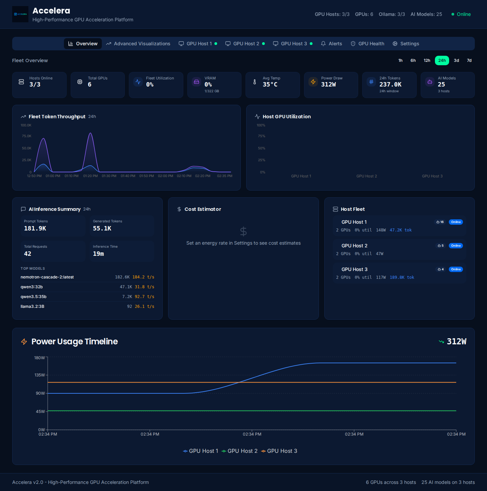
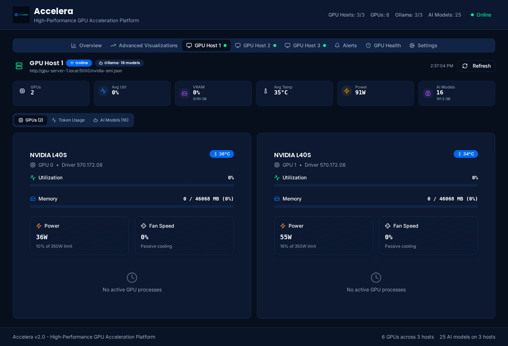
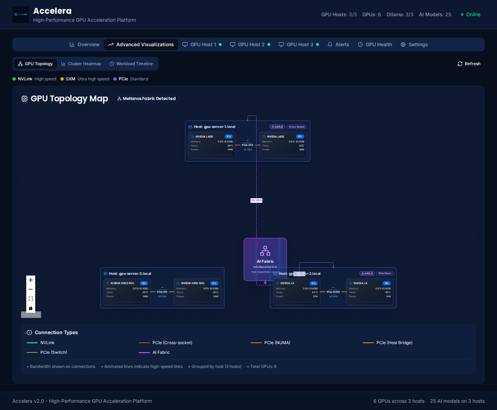
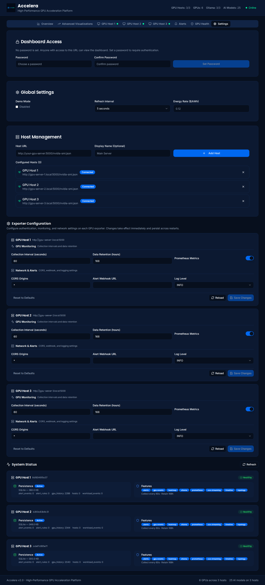

# Accelera — GPU Acceleration Platform

Real-time monitoring, AI workload management, and cluster analytics for NVIDIA GPU infrastructure.


<p align="center">
  
</p>

---

## Features

### Fleet Overview Dashboard
- **GPU metrics** — utilization, VRAM, temperature, power draw, fan speed
- **Multi-host** — monitor unlimited servers from a single pane
- **Fleet-wide token stats** — aggregate prompt/generated tokens, tokens/sec, cost estimation across all hosts
- **Time-range picker** — toggle 1 h / 6 h / 12 h / 24 h / 3 d / 7 d windows on overview and per-host stats
- **Per-host detail tabs** — deep-dive into individual server metrics, Ollama models, and token history

### AI Workload Integration
- **Ollama auto-discovery** — detects running Ollama instances on each GPU host
- **SGLang auto-discovery** — detects SGLang Runtime servers (OpenAI-compatible `/v1/models`)
- **Token statistics** — collected from Ollama Prometheus metrics, stored in SQLite, served via `/api/tokens/stats`
- **Per-model breakdown** — generated tokens, prompt tokens, requests, avg tokens/sec per model
- **Time-series charts** — 5-minute bucket token history with Recharts area/bar charts

### Advanced Visualizations
- **GPU topology map** — interactive ReactFlow diagram showing NVLink / SXM / PCIe interconnections
- **3D cluster heatmap** — Plotly.js surface plot for utilization, temperature, power, or memory over time
- **Live fabric activity** — NVLink + InfiniBand / RoCE per-port TX/RX rates overlaid on the topology, with link-layer and rate badges
- **Compact legends & time picker** — inline colored-dot legends, per-tab refresh, heatmap time range selector

### Cloud-Cost Equivalent
- **What did your tokens "save"?** — fleet-wide token usage is priced against ~330 commercial APIs (Claude, OpenAI, Gemini, Kimi, DeepSeek, Llama on OpenRouter, etc.)
- **Live OpenRouter catalog** — refreshed every 6 h, offline fallback for 17 flagship models, manual refresh button
- **Per-model breakdown** — `$/Mtok` in / out, prompt + completion cost split, sorted table with `Nx vs cheapest` bar
- **Time windows** — 24 h / 7 d / 30 d / all-time cumulative; filter by provider, search by model

### GPU Process Inspector
- **Deep process analysis** — PID, resolved name, command line, user, VRAM, uptime, CPU%
- **AI runtime detection** — automatically identifies Ollama, SGLang, vLLM, Triton, PyTorch processes
- **Model name resolution** — queries Ollama `/api/ps`, SGLang `/v1/models`, and vLLM `/v1/models` to match running models
- **Auto-refresh** — 10-second polling for near-real-time process monitoring
- **Enriched GPU cards** — process list on GPU cards shows resolved names, runtime badges, and model info

### AI Model Benchmark Runner
- **One-click benchmarks** — test Ollama, SGLang, and vLLM model throughput with preset prompts
- **Key metrics** — tokens/sec, time-to-first-token, generated tokens, total duration
- **Benchmark history** — results persisted in SQLite, viewable in a collapsible table

### Alerting & Events
- **Custom alert rules** — threshold-based alerts on any GPU metric (utilization, temp, power, memory)
- **GPU health events** — NVML error detection and dmesg Xid parsing
- **Webhook notifications** — Slack (Block Kit), Discord (embeds), and generic HTTP webhook delivery with auto-detection
- **Email notifications** — SMTP-based alert delivery

### Security
- **Server-side auth** — bcrypt password hashes, signed session cookies (HttpOnly + SameSite=Lax), first-run setup flow
- **Login lockout** — 5 failures → 30 s lockout with exponential backoff up to 15 min
- **Per-IP rate limiting** — 120 req / 60 s on the central backend, 600 req / 60 s on each GPU exporter
- **SSRF default-deny** — nginx `/api-proxy/` blocks all RFC1918 ranges unless explicitly allow-listed via `ALLOWED_PROXY_RANGE`; only port 5000 reachable
- **Cookie scrubbing** — central session cookies + `Authorization` headers are stripped before the `/api-proxy/` forwards to GPU exporters
- **Parameterized SQL** — no string interpolation in queries
- **Secret masking** — sensitive config values masked in API responses
- See [SECURITY.md](SECURITY.md) for the full audit and [`docs/REFACTOR_BACKLOG.md`](docs/REFACTOR_BACKLOG.md) for known limitations

---

## Screenshots

### Fleet Overview

*3-host GPU cluster with fleet token throughput, AI inference summary, power timeline, and host status.*

### Per-Host Detail

*Individual GPU cards with utilization, VRAM, temperature, power, fan speed, and running processes.*

### GPU Topology Map

*Interactive topology showing NVLink, PCIe, and Mellanox fabric interconnections across all hosts.*

### Settings & Host Management

*Dashboard access, refresh interval, energy rate, and host URL management.*

---

## Architecture

```
                       Browser (HTTPS / HTTP)
                               │
                               ▼
     ┌────────────────────────────────────────────┐
     │         Nginx 8080  (frontend container)        │
     │  • SPA static assets        │ SAMEORIGIN headers │
     │  • /api/         ───────────────────────┐   │
     │  • /api-proxy/<host>/<path>  (SSRF allowlist) │   │
     └──────────┬──────────────────────────│────────────────┘
                │                              │
                ▼                              ▼
  ┌──────────────────────────┐     ┌────────────────────────────┐
  │  Central backend :5001   │     │  GPU exporter(s) :5000     │
  │                          │     │                            │
  │  Auth (bcrypt, session)  │     │  /nvidia-smi.json          │
  │  Hosts CRUD + ordering   │     │  /api/topology  /heatmap   │
  │  Settings k/v store      │     │  /api/fabric/live          │
  │  Rate limit + lockout    │     │  /api/tokens/stats         │
  │  SQLite /app/data        │     │  /api/costs/models         │
  └──────────────────────────┘     │  /api/gpu/processes        │
                                  │  /api/alerts/*             │
                                  │  Flask + NVML + nvidia-smi │
                                  │  Ollama / SGLang / vLLM    │
                                  │  SQLite (per-host)         │
                                  └────────────────────────────┘
```

Two Flask services:

- **Central backend** — single instance, dedicated to authentication, host CRUD/ordering, and configuration storage.  All state in SQLite on a Docker volume.
- **GPU exporter** — one per GPU server, stateless w.r.t. users.  Exposes telemetry endpoints and per-host SQLite for time-series buffering.

The browser never talks to a GPU exporter directly: every request goes through the same-origin nginx with an SSRF allowlist (`ALLOWED_PROXY_RANGE`) and cookie/Authorization scrubbing on the exporter path.

---

## Quick Start

### Docker Compose (recommended)

```bash
git clone https://github.com/020003/accelera.git
cd accelera

# Start the frontend
docker compose -f docker-compose.frontend.yml up -d

# On each GPU server, deploy the exporter
docker compose -f docker-compose.gpu-exporter.yml up -d
```

Open `http://<frontend-host>:8080` and add your GPU hosts in the Settings tab.

### Helm Chart (Kubernetes / OpenShift)

A production-ready Helm chart is provided in [`helm/accelera/`](helm/accelera/).

```bash
# 1. Build and push images to your registry
docker build -t <REGISTRY>/accelera-frontend:latest -f Dockerfile .
docker push <REGISTRY>/accelera-frontend:latest

docker build -t <REGISTRY>/accelera-gpu-exporter:latest -f server/Dockerfile server/
docker push <REGISTRY>/accelera-gpu-exporter:latest

# 2. Label GPU nodes (if not already done by the NVIDIA GPU Operator)
kubectl label node <GPU_NODE> nvidia.com/gpu.present=true

# 3a. Install on Kubernetes
helm install accelera ./helm/accelera \
  --namespace accelera --create-namespace \
  --set frontend.image.repository=<REGISTRY>/accelera-frontend \
  --set gpuExporter.image.repository=<REGISTRY>/accelera-gpu-exporter \
  --set frontend.ingress.enabled=true \
  --set frontend.ingress.hosts[0].host=accelera.example.com \
  --set frontend.ingress.hosts[0].paths[0].path=/ \
  --set frontend.ingress.hosts[0].paths[0].pathType=Prefix

# 3b. Or install on OpenShift
helm install accelera ./helm/accelera \
  --namespace accelera --create-namespace \
  --set frontend.image.repository=<REGISTRY>/accelera-frontend \
  --set gpuExporter.image.repository=<REGISTRY>/accelera-gpu-exporter \
  --set openshift.enabled=true \
  --set openshift.route.enabled=true \
  --set openshift.route.host=accelera.apps.mycluster.example.com
```

The chart deploys:
- **Frontend** — Deployment + Service + Ingress (K8s) or Route (OpenShift)
- **GPU Exporter** — DaemonSet on every GPU node (`hostNetwork`, `hostPID`, `privileged`)
- **OpenShift SCC** — custom SecurityContextConstraints for privileged GPU access

See [`helm/accelera/README.md`](helm/accelera/README.md) for all values and configuration options.

### Development

```bash
# Frontend
npm install
npm run dev

# Backend (on a GPU server)
cd server
pip install -r requirements.txt
python app.py
```

---

## Configuration

All settings are via environment variables (`.env` file supported):

**Frontend / nginx**

| Variable | Default | Description |
|---|---|---|
| `ALLOWED_PROXY_RANGE` | `10\.` | Regex matched against `host:port` of every `/api-proxy/` request.  Defaults to the entire `10.0.0.0/8` block.  Set this tighter in production (e.g. `10\.2\.` for `10.2.x.x`).  Only port 5000 is ever reachable. |
| `BACKEND_URL` | `backend:5001` | DNS name of the central backend service inside the Docker network. |

**Central backend**

| Variable | Default | Description |
|---|---|---|
| `SECRET_KEY` | *(generated and persisted)* | Signs session cookies.  Auto-generated on first start and saved to `/app/data/.secret_key` (0600).  Set explicitly to keep sessions across volume wipes. |
| `SESSION_LIFETIME_HOURS` | `24` | Session cookie lifetime. |
| `SESSION_COOKIE_SECURE` | `false` | Set to `true` when serving over HTTPS so cookies are only sent over TLS. |
| `FLASK_HOST` / `FLASK_PORT` | `0.0.0.0` / `5001` | Bind address and port (used inside the container; nginx is the public surface). |

**GPU exporter (one per host)**

| Variable | Default | Description |
|---|---|---|
| `FLASK_HOST` | `0.0.0.0` | Bind address |
| `FLASK_PORT` | `5000` | API port |
| `FLASK_SECRET_KEY` | *(auto-generated)* | Stateless w.r.t. sessions, but used to sign internal tokens; auto-generated if unset |
| `FLASK_DEBUG` | `false` | Debug mode — keep `false` outside development |
| `CORS_ORIGINS` | `*` | Allowed origins.  **The exporter has no auth; lock the network instead of relying on this.**  Set explicitly to your nginx origin in production. |
| `GPU_COLLECT_INTERVAL` | `60` | GPU metric collection interval (seconds) |
| `HISTORICAL_DATA_RETENTION` | `168` | Data retention (hours) |
| `COST_CACHE_TTL` | `21600` | Cloud-model pricing catalog cache TTL (seconds, default 6 h) |
| `OLLAMA_URL` / `OLLAMA_METRICS_URL` | *(auto-discover)* | Ollama API + Prometheus URLs |
| `SGLANG_URL` | *(auto-discover)* | SGLang Runtime URL |
| `VLLM_URL` | *(auto-discover)* | vLLM URL |

See [`.env.example`](.env.example) for the full list.

---

## API Reference

**Central backend** (proxied to the browser as same-origin `/api/...`)

| Method | Endpoint | Description |
|---|---|---|
| `POST` | `/api/auth/setup` | First-run admin account creation |
| `POST` | `/api/auth/login` | Verify credentials, create session |
| `POST` | `/api/auth/logout` | Clear session |
| `GET` | `/api/auth/status` | Current session + `needsSetup` flag |
| `PUT` | `/api/auth/password` | Change own password |
| `GET` | `/api/hosts` | List configured hosts (ordered by `position`) |
| `POST` | `/api/hosts` | Add a host (URL validated) |
| `PATCH` | `/api/hosts/<url>` | Rename a host (80-char max) |
| `DELETE` | `/api/hosts/<url>` | Remove a host |
| `PUT` | `/api/hosts/order` | Persist a new host ordering (body: list of URLs) |
| `GET` / `PUT` | `/api/settings` | Runtime configuration k/v store |
| `GET` | `/api/costs/models` | Cached cloud-API pricing catalog (`?refresh=1` to force re-pull, v2.4: moved from exporter) |
| `GET` | `/api/costs/calculate` | Per-model cost for given prompt/completion totals |
| `GET` / `POST` / `DELETE` | `/api/auth/tokens` | API token CRUD (session-auth) |

**GPU exporter** (proxied as `/api-proxy/<host>:5000/...`)

| Method | Endpoint | Description |
|---|---|---|
| `GET` | `/nvidia-smi.json` | Current GPU metrics |
| `GET` | `/api/health` | Health check |
| `GET` | `/api/topology` | GPU interconnect topology |
| `GET` | `/api/fabric/live` | Live NVLink + IB / RoCE TX/RX rates |
| `GET` | `/api/heatmap?metric=utilization&hours=6` | Historical heatmap data |
| `GET` | `/api/timeline` | AI workload timeline events |
| `GET` | `/api/tokens/stats?hours=24` | Token usage statistics |
| `POST` | `/api/ollama/discover` | Discover Ollama on a host |
| `POST` | `/api/sglang/discover` | Discover SGLang Runtime on a host |
| `POST` | `/api/vllm/discover` | Discover vLLM on a host |
| `GET` | `/api/gpu/events` | GPU health events (NVML + Xid) |
| `GET/POST` | `/api/alerts/rules` | Alert rule CRUD |
| `GET` | `/api/alerts/events` | Alert event history |
| `GET/PUT` | `/api/settings` | Runtime configuration |
| `GET` | `/api/gpu/processes` | Enriched GPU process list (PID, name, user, uptime, CPU%, model) |
| `GET` | `/api/benchmarks/presets` | Benchmark prompt presets |
| `POST` | `/api/benchmarks/run` | Run a benchmark against Ollama, SGLang, or vLLM |
| `GET` | `/api/benchmarks/results` | Benchmark result history |
| `GET/PUT` | `/api/alerts/webhook` | Webhook configuration |
| `POST` | `/api/alerts/webhook/test` | Send test webhook notification |

---

## Public API (v1)

A bearer-token authenticated REST API for Grafana, scripts, CI, and third-party integrations. All endpoints live under `/api/v1` on the central backend and share the same nginx ingress as the dashboard.

### Interactive docs

| URL | Description |
|---|---|
| `/api/v1/docs` | Swagger UI — try every endpoint from the browser. Click **Authorize** to paste a bearer token (persists across reloads). |
| `/api/v1/openapi.json` | OpenAPI 3.1 spec for code generation, Postman, Insomnia, etc. |

### Authentication

Mint a token in the dashboard at **Settings → API Tokens**. Tokens look like `acc_a1b2c3d4...` and are shown exactly once.

```bash
curl -H "Authorization: Bearer acc_<your-token>" \
     https://accelera.example.com/api/v1/whoami
```

Tokens are stored bcrypt-hashed (per-token salt, lookup by 12-char prefix). Revocation is immediate. Optional expiry: 30 d / 90 d / 180 d / 1 y / never. Scopes: `read` (default) or `read:write`.

### Endpoints

| Method | Endpoint | Description |
|---|---|---|
| `GET` | `/api/v1` | Unauthenticated index of available routes |
| `GET` | `/api/v1/whoami` | Metadata about the calling token |
| `GET` | `/api/v1/hosts` | Configured fleet members (user-defined order) |
| `GET` | `/api/v1/fleet/summary` | Parallel fan-out GPU snapshot + fleet-wide totals |
| `GET` | `/api/v1/fleet/tokens` | Aggregated LLM token usage (`?hours=1..720`) |
| `GET` | `/api/v1/costs/models` | Cloud-model pricing catalog |
| `GET` | `/api/v1/costs/calculate` | `?prompt_tokens=N&completion_tokens=N` → ranked cost table |

### Example: fleet snapshot

```bash
curl -s -H "Authorization: Bearer acc_..." \
     https://accelera.example.com/api/v1/fleet/summary | jq '.totals'
# {
#   "gpu_count":         32,
#   "power_w":           8417.5,
#   "memory_used_mib":   412800,
#   "memory_total_mib":  2621440,
#   "connected":         4
# }
```

### Example: what would last week's tokens have cost on Claude / GPT-4o?

```bash
curl -s -H "Authorization: Bearer acc_..." \
     "https://accelera.example.com/api/v1/fleet/tokens?hours=168" \
  | jq '.totals'
# { "prompt_tokens": 12480000, "completion_tokens": 4310000, ... }

curl -s -H "Authorization: Bearer acc_..." \
     "https://accelera.example.com/api/v1/costs/calculate?prompt_tokens=12480000&completion_tokens=4310000" \
  | jq '.models[0:3] | map({name, cost_total_usd})'
# [
#   { "name": "Llama 3.3 70B",    "cost_total_usd":  4595.04 },
#   { "name": "DeepSeek V3",      "cost_total_usd":  8109.60 },
#   { "name": "Claude Haiku 3.5", "cost_total_usd": 27224.00 }
# ]
```

### Rate limiting & errors

The API shares the same per-IP rate limiter as the dashboard (default 120 req/min). Standard HTTP codes apply: `401` (missing/invalid bearer), `403` (insufficient scope), `404`, `429`, `5xx`. Error bodies are JSON: `{"error": "..."}`.

---

## Tech Stack

**Frontend**: React 18, TypeScript, Vite, TailwindCSS, shadcn/ui, TanStack React Query, Recharts, Plotly.js, ReactFlow, vis-timeline

**Central backend**: Flask 3.0, Python 3.10+, Gunicorn (1 worker × 4 threads), bcrypt, SQLite (WAL mode)

**GPU exporter**: Flask 3.0, Python 3.10+, nvidia-ml-py3, NVML, SQLite (WAL mode)

**Proxy**: nginx 1.29 with envsubst-templated SSRF allowlist

**Deployment**: Docker Compose, Helm Chart (Kubernetes / OpenShift)

---

## Multi-Host Setup

1. Deploy the **GPU exporter** container on each server with NVIDIA GPUs
2. Deploy the **frontend** container on any machine (no GPU required)
3. Open the dashboard and add each host via Settings: `http://<gpu-host>:5000/nvidia-smi.json`

The frontend fetches metrics from each exporter independently and aggregates them in the browser.

### Deployment Environments

| Environment | AI Runtime URLs | Notes |
|---|---|---|
| **Docker Compose** | `http://host.docker.internal:<port>` | `extra_hosts` mapping added automatically |
| **Helm (K8s/OpenShift)** | `http://localhost:<port>` | DaemonSet with `hostNetwork`; see `helm/accelera/` |
| **Bare-metal** | `http://localhost:<port>` | Run `pip install -r server/requirements.txt && python server/app.py` |
| **No-GPU host** | N/A | Exporter still serves Ollama/SGLang/vLLM token stats with empty GPU list |

Copy `.env.example` to `.env` on each host and configure as needed. The exporter auto-discovers Ollama, SGLang, and vLLM on common ports if URLs are not set explicitly.

---

## Contributing

1. Fork the repository
2. Create a feature branch (`git checkout -b feature/my-feature`)
3. Commit changes (`git commit -m 'Add my feature'`)
4. Push and open a Pull Request

See [CONTRIBUTING.md](CONTRIBUTING.md) for guidelines.

---

## License

[AGPL-3.0](LICENSE.md) — free for open-source and personal use. Modifications must be shared under the same license. Network use requires source availability.

---

## Acknowledgments

- [NVIDIA](https://nvidia.com) — GPU computing and NVML
- [Ollama](https://ollama.com) — local AI model serving
- [shadcn/ui](https://ui.shadcn.com) — UI component library
- [Recharts](https://recharts.org) / [Plotly.js](https://plotly.com/javascript/) — charting
- [ReactFlow](https://reactflow.dev) — topology diagrams
- [vis-timeline](https://visjs.github.io/vis-timeline/) — Gantt timelines